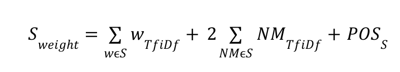

# NLP Text Summerizer

Text summerizer implementation in Python 3.

This document will be updated later.

# Sample projects
Here you can find a sample summerizer: 
1. Summa Textrank: https://github.com/summanlp/textrank
2. Summy: https://github.com/miso-belica/sumy

# Project details

The detailed overleaf document could be found from here: https://www.overleaf.com/8834188557dskgqvmsthhk

We shall consider structured document containing a title, abstract and a set of subsections. We would like to build a text summarizer such that it tracks important keywords in the document. For this purpose, the first step is identify these keywords. 

## Stage 1
Assume the initial input is given as html document (choose an example of your own), we hypothesize that important keywords are initially contained in the words of titles, abstract and possibly titles of subsections of the document. Suggest a simple python script that inputs an html document and outputs the lists of words in the title, abstract and title of section/subsections. 


## Stage 2
Write down a simple python script that allows you to output the histogram of word frequency in the document, excluding the stopwords (see examples in online NLTK book). Use SpaCy named-entity tagger to identify person-named entities and organization-named entities in the document.

## Stage 3
We would like the summarizer to contain frequent wording (excluding stopwords) and as many named-entities as possible. For this purpose, use the following heuristic to construct the summarizer. First we shall assume each sentence of the document as individual sub-document. Use TfIdf vectorizer to output the individual tfidef score of each word of each sentence (after initial preprocessing and wordnet lemmatization stage). Then consider only sentences that contain person or organization named-entities and use similar approach to output the tfidf score of the named-entities in each sentence. Finally construct the sentence (S) weight as a  weighted sum: 

 

where NM <sub>TfiDF</sub> stands for the TfIdF of named-entity NM in sentence S.  POS<sub>S</sub> corresponds to the sentence weight associated to the location of the sentence. So that the sentence location weight will be maximum (1) if located in the title of the document, 0.5 if located  in the title of one of the subsection, 0.25 if located in the title one of the subsubsection, 0.1 if located in one representative object of the document, and 0 if located only in the main text. Make sure to normalize the term tfidf and Nm tfidf weights and suggest a script to implement the preceding accordingly, so that the summarizer will contain the 10 sentences with the highest S<sub>weight</sub> scores.

## Stage 4
Test the above approach with Opinosis dataset available at https://kavita-ganesan.com/opinosis-opinion-dataset/#.YVw6J5ozY2x,  and record the corresponding Rouge-2 and Rouge-3 evaluation score. 

## Stage 5
We would like to improve the summarization by taking into account the diversity among the sentence in the sense that *we would like to minimize redundancy among sentences*. For this purpose, we shall use the sentence-to-sentence semantic similarity introduced in the NLP lab. 

Next, instead of recording only the 10 sentences with highest S<sub>weight</sub> scores, we shall record the 20 top sentences in terms of S<sub>weight</sub> scores. Then the selection of the top 10 sentences among the 20 sentences follows the following approach:

- First, order the 20 sentences in the decreasing order of their S<sub>weight</sub> scores, say S<sub>1</sub>, S<sub>2</sub>, …, S<sub>20</sub> (where S<sub>1</sub> is the top ranked and S<sub>20</sub> the 20th ranked sentence).

- Second, we shall assume that S<sub>1</sub> is always included in the summarizer, we shall then attempt to find the other sentences among S<sub>2</sub> till S<sub>20</sub> to be included into the summarizer.

- In the third phase, calculate the __sentence-to-sentence similarity__ `Sim(S1,Si)` for *i= 1 to 20*, the Sentence S<sub>j</sub> that yields **the minimum similarity** with S<sub>1</sub> will therefore be included in the summarizer.

- Next, for each of the remaining sentences S<sub>k</sub> (with k different from 1 and j), we calculate the sentence similarity with S<sub>j</sub>. Therefore the sentence S<sub>p</sub> that yields **minimum value of** `Sim (Sp, S1) + Sim(Sp, Sj)` will be included in the summarizer. 

- In the next phase, we should select a sentence S<sub>l</sub> (l different from 1, j and k) so that  `Sim(Sl, S1) + Sim(Sl, Sj) + Sim(Sl, Sp)`, etc. You then stop once you reached 10 sentences included in the summarizer. Suggest a script that includes this process, and illustrate its functioning in the example you chosen in 1). In other words you can imagine that the forth phase is like a recursive function, in which each time you add another sentence to the candidate summerised sentences and for the next candidate you should again calculate a summation of each similarities. So, we would have:   

    Round 1: First candidate sentence is S<sub>1</sub>. So, we have CS1 as summerized sentence (CS: Candidate Summarized Sentence).
    
    Round 2: `CS2 = Minimum(CS1, Si)` for i = 1, j (j is the length of unselected sentences)
    
    Round 3: `CS3 = Minimum(Sim(CS1, Si) + Sim(CS2, Si))` for i = 1 to j (j is the length of unselected sentences)

    Round 4: `CS4 = Minimum(Sim(CS1, Si) + Sim(CS2, Si) + Sim(CS3, Si))` for i = 1 to j (j is the length of unselected sentences)

    Final Round: Once CS set gets to 10 sentences it is done!

    **Note**: the quantity `Sim(Sp, S1)` is already calculated in previous step).

## Stage 6
We would like to make the choice of keywords not based on histogram frequency but __using the open source RAKE__ https://www.airpair.com/nlp/keyword-extraction-tutorial. Repeat the previous process of selecting the sentences that are associated to the ten first keywords generated by RAKE. Comment on the quality of this summarizer based on your observation.

## Stage 7
It is also suggested to explore alternative implementations with larger number of summarization approaches implemented - https://github.com/miso-belica/sumy. Show how each of the implemented summarizer behaves when inputted with the same document you used in previous case.

## Stage 8
Now we would like to compare the above summarizers and those in 3), 5) and 7) on a new dataset constructed as follows: 

- First select an Elsevier journal of your own and select 10 papers highly ranked in the journal according to citation index (The journal papers should be well structured to contain Abstract, Introduction and Conclusion). 

- For each of the ten papers: 
    1. Consider the __introduction__ as the main document to seek to apply summarizer.
    2. consider the Abstract and Conclusion as two golden summary of the document that you can use for assessment using ROUGE-1 and ROUGE-2 evaluation. 
    3. Report in a table the evaluation score of each summarizer. 

## Stage 9
Design a simple GUI that allows the user to input a text or a link to a document to be summarized and output the summarizer according to 3), algorithms implemented in 7)

## Rake Library

A Python implementation of the Rapid Automatic Keyword Extraction (RAKE) algorithm as described in: Rose, S., Engel, D., Cramer, N., & Cowley, W. (2010). Automatic Keyword Extraction from Individual Documents. In M. W. Berry & J. Kogan (Eds.), Text Mining: Theory and Applications: John Wiley & Sons.

## Instaling Rake

` pip install rake-nltk `

## Usage

``` 
r = Rake()
text="Feature extraction is not that complex. There are many algorithms available that can help you with feature extraction. Rapid Automatic Key Word Extraction is one of those"
r.extract_keywords_from_text(text)
print(r.get_ranked_phrases())
#outout
['rapid automatic key word extraction',
 'many algorithms available',
 'feature extraction',
 'one',
 'help',
 'complex']

```

## Special Case

```
print(r.get_ranked_phrases_with_scores())

#output

[(23.5, 'rapid automatic key word extraction'),

```
